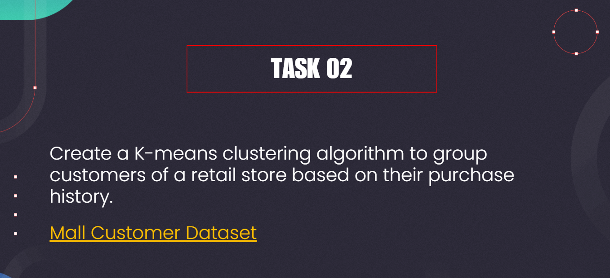
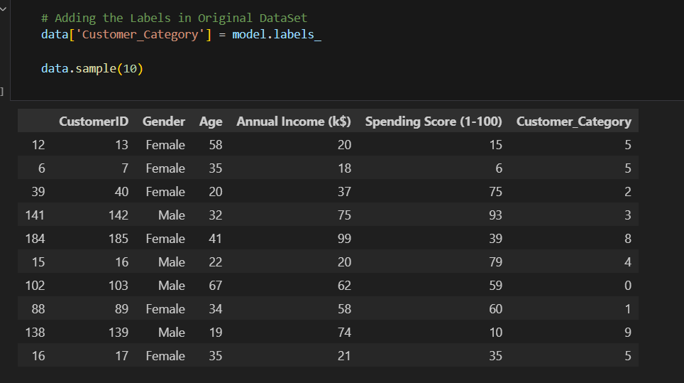
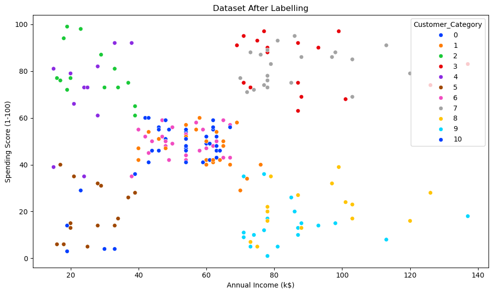
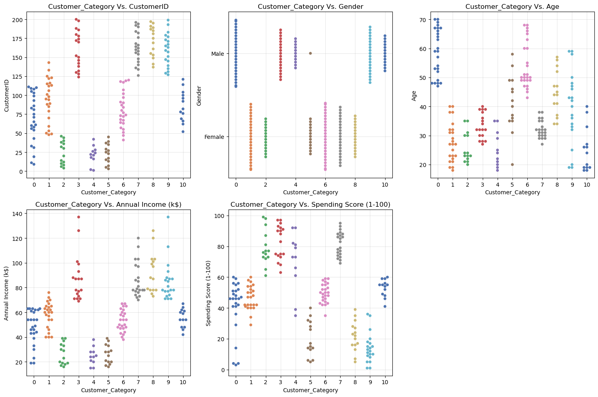

# Mall Customers Clustering – Unsupervised Learning Project

# Overview 

This repository demonstrates unsupervised machine learning techniques on the popular Mall_Customers dataset. 
The aim is to analyze customer behavior and segment shoppers into meaningful groups using clustering algorithms. 
All steps—from raw data loading and preprocessing through model building and results interpretation—are documented in a Jupyter Notebook.

# Features

Data Exploration: Initial inspection of customer demographics (Age, Gender, Annual Income, Spending Score).

Preprocessing:

Label encoding for categorical features (Gender).

Standardization for feature scaling.

Clustering Algorithm:

K-Means clustering applied to customer data.

Identification of optimal cluster count using the Elbow Method.

Visualization:

Scatter plots and cluster overlays for visual validation of groups.

Interpret clusters in terms of spending scores, income, age, and gender.

Customer Segmentation:

Assignment of each customer to a cluster/category (Customer_Category).

Cluster analysis to understand business opportunities for targeted marketing.

# Project Structure

task_02.ipynb: Main notebook documenting the entire analysis pipeline.

Mall_Customers.csv: Dataset used (should be placed in the project directory).

# Step-by-Step Workflow

1. Import Libraries

numpy, pandas, seaborn, matplotlib

scikit-learn (LabelEncoder, StandardScaler, KMeans)

pickle for saving objects

2. Load Data

Read Mall_Customers.csv into a pandas DataFrame.

Display initial records for inspection.

3. Preprocessing

Label Encoding: Convert Gender from ‘Male’/'Female' to numerical values.

Feature Scaling: Standardize the features for clustering analysis.

4. Clustering with K-Means

Fit K-Means algorithm on normalized customer features.

Use Elbow method to identify optimal number of clusters.

Assign cluster labels (Customer_Category) to each record.

5. Visualization and Insights

Visualize clusters and centroids.

Analyze cluster characteristics (e.g., high spenders vs. budget shoppers).

6. Results Output

Output DataFrame with cluster assignment:

# How to Use

Clone this repository.

Ensure task_02.ipynb and Mall_Customers.csv are in your working directory.

Install required libraries:

pip install pandas numpy seaborn matplotlib scikit-learn

Open the notebook in Jupyter and run all cells.

# Business Application

Understand customer segments for targeted campaigns.

Prioritize high-value shoppers for loyalty initiatives.

Guide store layout and product selection using behavioral insights.

